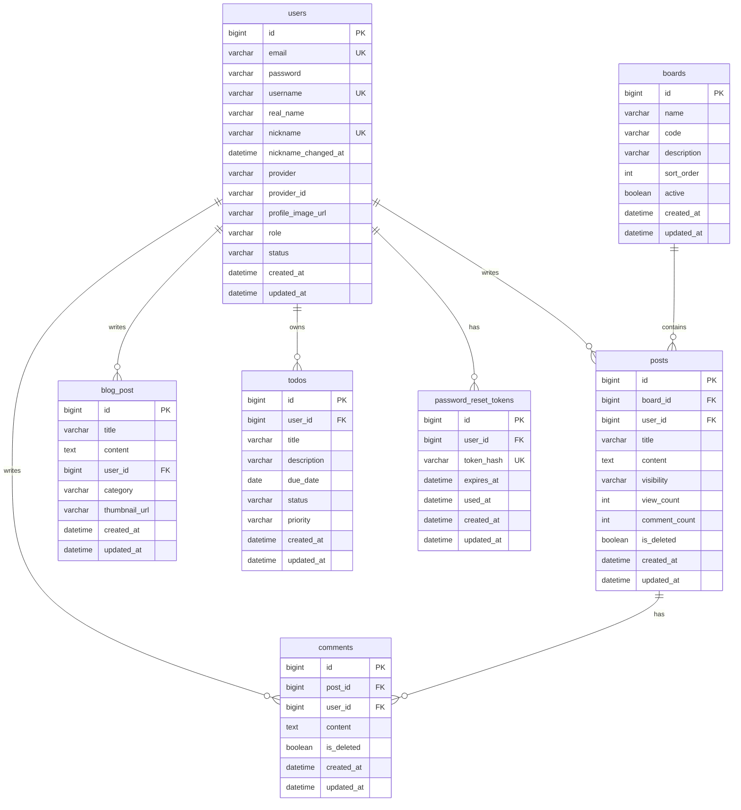

# Flatform

## 목적

웹 애플리케이션에서 클라이언트, 서버, 데이터베이스가 연결되는 흐름을 이해하기 위해 진행한 프로젝트입니다.  
사용자 요청을 처리하고 결과를 화면에 반영하는 과정을 직접 구현해보는 데 목적을 두었습니다.

## 프로젝트 소개

React와 Spring Boot를 기반으로 구현한 개인 웹 애플리케이션 프로젝트입니다.  
MariaDB를 활용해 사용자 데이터와 서비스 기능을 관리하는 구조로 개발했습니다.

회원 기능, 게시판, 댓글, 검색, Todo, 블로그, 외부 API 연동, AI 요약 기능 등을 구현했습니다.

## Preview


## 검증 기준

- 백엔드 엔티티: `backend/community-backend/src/main/java/com/community/communitybackend/entity`
- 백엔드 컨트롤러/DTO/서비스: `controller`, `dto`, `service`, `repository` 패키지
- 프론트엔드 라우팅/API 호출: `frontend/community-frontend/src/App.tsx`, `src/api`
- 환경 설정: `backend/community-backend/.env.example`, `application-example.yml`, `frontend/community-frontend/vite.config.ts`
- 검증 명령
  - `backend/community-backend`: `.\gradlew.bat test --rerun-tasks`
  - `frontend/community-frontend`: `npm.cmd run build`

## 기술 스택

| 영역 | 기술 |
| --- | --- |
| Frontend | React 19, TypeScript, Vite 8, React Router, Fetch API |
| Backend | Java 17, Spring Boot 4, Spring Web, Spring Data JPA, Spring Security, OAuth2 Client, Mail |
| Database | MariaDB |
| External API | Naver Search API, Gemini API, Worknet API, Open-Meteo, ExchangeRate API, Yahoo Finance, Naver Webtoon page parsing |

## 프로젝트 구조

```text
community-project
├── backend/community-backend      # Spring Boot API 서버
├── frontend/community-frontend    # React/Vite 프론트엔드
└── docs                           # 환경 설정 문서
```

## 실행 방법

### Backend

```powershell
cd backend/community-backend
copy .env.example .env
copy src/main/resources/application-example.yml src/main/resources/application.yml
.\gradlew.bat bootRun
```

주요 환경 변수는 `.env.example`에 정의되어 있습니다. 기본 서버 포트는 `8080`입니다.

### Frontend

```powershell
cd frontend/community-frontend
npm.cmd install
npm.cmd run dev
```

`VITE_API_BASE_URL`을 비워두면 프론트엔드는 `/api` 상대 경로로 요청하고, Vite 개발 서버가 `http://localhost:8080`으로 프록시합니다. 배포처럼 백엔드 주소를 직접 지정해야 하는 경우에만 `VITE_API_BASE_URL`을 설정합니다.

## ERD



## 엔티티 목록과 필드

| 엔티티 | 테이블 | 필드 |
| --- | --- | --- |
| User | `users` | `id`, `email`, `password`, `username`, `realName`, `nickname`, `nicknameChangedAt`, `provider`, `providerId`, `profileImageUrl`, `role`, `status`, `createdAt`, `updatedAt` |
| Board | `boards` | `id`, `name`, `code`, `description`, `sortOrder`, `active`, `createdAt`, `updatedAt` |
| Post | `posts` | `id`, `board`, `user`, `title`, `content`, `visibility`, `viewCount`, `commentCount`, `deleted`, `createdAt`, `updatedAt` |
| Comment | `comments` | `id`, `post`, `user`, `content`, `deleted`, `createdAt`, `updatedAt` |
| BlogPost | `blog_post` | `id`, `title`, `content`, `user`, `category`, `thumbnailUrl`, `createdAt`, `updatedAt` |
| Todo | `todos` | `id`, `user`, `title`, `description`, `dueDate`, `status`, `priority`, `createdAt`, `updatedAt` |
| PasswordResetToken | `password_reset_tokens` | `id`, `user`, `tokenHash`, `expiresAt`, `usedAt`, `createdAt`, `updatedAt` |

## 테이블 관계

| 관계 | 설명 |
| --- | --- |
| User 1:N Post | 한 사용자는 여러 게시글을 작성할 수 있습니다. `posts.user_id`가 `users.id`를 참조합니다. |
| Board 1:N Post | 한 게시판에는 여러 게시글이 속합니다. `posts.board_id`가 `boards.id`를 참조합니다. |
| Post 1:N Comment | 한 게시글에는 여러 댓글이 달릴 수 있습니다. `comments.post_id`가 `posts.id`를 참조합니다. |
| User 1:N Comment | 한 사용자는 여러 댓글을 작성할 수 있습니다. `comments.user_id`가 `users.id`를 참조합니다. |
| User 1:N BlogPost | 한 사용자는 여러 블로그 글을 작성할 수 있습니다. `blog_post.user_id`가 `users.id`를 참조합니다. |
| User 1:N Todo | 한 사용자는 여러 Todo를 가질 수 있습니다. `todos.user_id`가 `users.id`를 참조합니다. |
| User 1:N PasswordResetToken | 한 사용자는 여러 비밀번호 재설정 토큰을 가질 수 있습니다. `password_reset_tokens.user_id`가 `users.id`를 참조합니다. |

## API 응답 형식

대부분의 컨트롤러는 아래 공통 래퍼를 반환합니다.

```json
{
  "success": true,
  "data": {},
  "message": null
}
```

예외적으로 `/api/blog/**`는 `ApiResponse` 래퍼 없이 DTO 또는 `void`를 직접 반환하고, `/api/search/**`는 Naver API 응답 JSON 문자열을 그대로 반환합니다.

## API 명세

### Auth

| Method | Endpoint | 설명 | 요청 | 응답 |
| --- | --- | --- | --- | --- |
| POST | `/api/auth/signup` | 일반 회원가입 | `username`, `email`, `password`, `nickname`, `realName` | `AuthResponseDto`: `success`, `message`, `userId`, `username`, `nickname`, `role` |
| POST | `/api/auth/login` | 일반 로그인 | `username`, `password` | `AuthResponseDto` |
| POST | `/api/auth/find-username` | 이메일로 아이디 찾기 메일 발송 | `email` | `AccountRecoveryResponseDto`: `message` |
| POST | `/api/auth/password-reset/request` | 비밀번호 재설정 메일 발송 | `username`, `email` | `AccountRecoveryResponseDto` |
| POST | `/api/auth/password-reset/confirm` | 비밀번호 재설정 확정 | `token`, `newPassword` | `AccountRecoveryResponseDto` |
| PUT | `/api/auth/nickname` | 닉네임 변경 | `userId`, `nickname` | `AuthResponseDto` |

### User

| Method | Endpoint | 설명 | 요청 | 응답 |
| --- | --- | --- | --- | --- |
| GET | `/api/users/{userId}` | 사용자 단건 조회 | Path: `userId` | `UserResponseDto`: `id`, `email`, `username`, `realName`, `nickname`, `nicknameChangedAt`, `provider`, `providerId`, `profileImageUrl`, `role`, `status`, `createdAt`, `updatedAt` |

### Board

| Method | Endpoint | 설명 | 요청 | 응답 |
| --- | --- | --- | --- | --- |
| GET | `/api/boards` | 활성 게시판 목록 조회 | 없음 | `BoardResponseDto[]` |
| GET | `/api/boards/{boardId}` | 게시판 단건 조회 | Path: `boardId` | `BoardResponseDto` |
| GET | `/api/boards/{boardId}/posts` | 게시판별 게시글 목록 조회 | Path: `boardId` | `PostResponseDto[]` |

### Post

| Method | Endpoint | 설명 | 요청 | 응답 |
| --- | --- | --- | --- | --- |
| POST | `/api/posts` | 게시글 작성 | `boardId`, `userId`, `title`, `content` | `PostResponseDto` |
| GET | `/api/posts` | 삭제되지 않은 전체 게시글 목록 | 없음 | `PostResponseDto[]` |
| GET | `/api/posts/{postId}` | 게시글 단건 조회 | Path: `postId` | `PostResponseDto` |
| GET | `/api/posts/{postId}/detail` | 게시글과 댓글 동시 조회 | Path: `postId` | `{ post: PostResponseDto, comments: CommentResponseDto[] }` |
| GET | `/api/posts/board/{boardId}` | 게시판별 게시글 목록 조회 | Path: `boardId` | `PostResponseDto[]` |
| GET | `/api/posts/user/{userId}` | 사용자별 게시글 목록 조회 | Path: `userId` | `PostResponseDto[]` |
| GET | `/api/posts/search` | 게시글 검색 | Query: `keyword`, `sort=date\|sim` | `PostResponseDto[]` |
| PUT | `/api/posts/{postId}` | 게시글 수정 | Path: `postId`, Body: `userId`, `role`, `title`, `content` | `PostResponseDto` |
| DELETE | `/api/posts/{postId}` | 게시글 소프트 삭제 | Path: `postId`, Query: `userId`, `role` | `String` |

`PostResponseDto` 필드: `id`, `boardId`, `boardName`, `userId`, `username`, `nickname`, `title`, `content`, `visibility`, `viewCount`, `commentCount`, `deleted`, `createdAt`, `updatedAt`

### Comment

| Method | Endpoint | 설명 | 요청 | 응답 |
| --- | --- | --- | --- | --- |
| POST | `/api/comments` | 댓글 작성 | `postId`, `userId`, `content` | `CommentResponseDto` |
| GET | `/api/comments/post/{postId}` | 게시글별 댓글 조회 | Path: `postId` | `CommentResponseDto[]` |
| GET | `/api/comments/user/{userId}` | 사용자별 댓글 조회 | Path: `userId` | `CommentResponseDto[]` |
| PUT | `/api/comments/{commentId}` | 댓글 수정 | Path: `commentId`, Body: `userId`, `role`, `content` | `CommentResponseDto` |
| DELETE | `/api/comments/{commentId}` | 댓글 소프트 삭제 | Path: `commentId`, Query: `userId`, `role` | `String` |

`CommentResponseDto` 필드: `id`, `postId`, `userId`, `content`, `deleted`, `createdAt`

### Blog

| Method | Endpoint | 설명 | 요청 | 응답 |
| --- | --- | --- | --- | --- |
| GET | `/api/blog` | 블로그 글 목록 조회 | 없음 | `BlogPostResponseDto[]` |
| GET | `/api/blog/{id}` | 블로그 글 단건 조회 | Path: `id` | `BlogPostResponseDto` |
| POST | `/api/blog` | 블로그 글 작성 | `title`, `content`, `category`, `thumbnailUrl`, `userId` | `BlogPostResponseDto` |
| PUT | `/api/blog/{id}` | 블로그 글 수정 | Path: `id`, Query: `userId`, Body: `title`, `content`, `category`, `thumbnailUrl` | `BlogPostResponseDto` |
| DELETE | `/api/blog/{id}` | 블로그 글 삭제 | Path: `id`, Query: `userId` | 본문 없음 |

`BlogPostResponseDto` 필드: `id`, `title`, `content`, `category`, `thumbnailUrl`, `author`, `createdAt`, `userId`

### Todo

| Method | Endpoint | 설명 | 요청 | 응답 |
| --- | --- | --- | --- | --- |
| POST | `/api/todos` | Todo 생성 | `userId`, `title`, `description`, `dueDate`, `priority` | `TodoResponseDto` |
| GET | `/api/todos/user/{userId}` | 사용자별 Todo 목록 조회 | Path: `userId` | `TodoResponseDto[]` |
| PUT | `/api/todos/{todoId}` | Todo 수정 | Path: `todoId`, Body: `title`, `description`, `dueDate`, `priority`, `status` | `TodoResponseDto` |
| PATCH | `/api/todos/{todoId}/status` | Todo 상태 변경 | Path: `todoId`, Body: `status` | `TodoResponseDto` |
| DELETE | `/api/todos/{todoId}` | Todo 삭제 | Path: `todoId` | `null` |

`TodoResponseDto` 필드: `id`, `userId`, `title`, `description`, `dueDate`, `status`, `priority`, `createdAt`, `updatedAt`

### Search

| Method | Endpoint | 설명 | 요청 | 응답 |
| --- | --- | --- | --- | --- |
| GET | `/api/search/web` | Naver 웹 검색 | Query: `keyword`, `page=1`, `display=10`, `sort=date` | Naver 검색 JSON 문자열 |
| GET | `/api/search/news` | Naver 뉴스 검색 | Query: `keyword`, `page=1`, `display=10`, `sort=date` | Naver 검색 JSON 문자열 |
| GET | `/api/search/blog` | Naver 블로그 검색 | Query: `keyword`, `page=1`, `display=10`, `sort=date` | Naver 검색 JSON 문자열 |
| GET | `/api/search/image` | Naver 이미지 검색 | Query: `keyword`, `page=1`, `display=10`, `sort=sim` | Naver 이미지 검색 JSON 문자열 |

### AI Search

| Method | Endpoint | 설명 | 요청 | 응답 |
| --- | --- | --- | --- | --- |
| POST | `/api/ai/search-summary` | 검색 결과 기반 AI 요약 생성 | `keyword`, `sources[]` | `summary`, `intent`, `followUpQuestions`, `referenceSources`, `recommendedLinks`, `evidenceSources` |

`sources[]` 필드: `type`, `title`, `description`, `link`

### Main

| Method | Endpoint | 설명 | 요청 | 응답 |
| --- | --- | --- | --- | --- |
| GET | `/api/main/summary` | 메인 화면 요약 데이터 조회 | 없음 | `posts`, `news`, `weather`, `exchangeRate`, `marketStocks`, `shoppingItems`, `webtoonItems`, 각 오류 필드 |
| GET | `/api/main/news` | 메인 뉴스 목록 조회 | Query: `keyword` | `NewsPreviewDto[]` |
| GET | `/api/main/shopping` | 메인 쇼핑 목록 조회 | Query: `keyword` | `ShoppingPreviewDto[]` |
| GET | `/api/main/webtoons` | 메인 웹툰 목록 조회 | Query: `week` | `WebtoonPreviewDto[]` |

### Career

| Method | Endpoint | 설명 | 요청 | 응답 |
| --- | --- | --- | --- | --- |
| GET | `/api/career/portal` | 커리어 포털 종합 데이터 조회 | Query: `keyword`, `region`, `minSalary`, `maxSalary` | `jobPostings`, `certificationSites`, `contestInfos`, `careerRecordCards`, `jobError`, `certificationNotice`, `contestError`, `sourceStatus` |
| GET | `/api/career/jobs` | 채용 공고 목록 조회 | Query: `keyword`, `region`, `minSalary`, `maxSalary` | `JobPostingDto[]` |

## 주요 기능

### 회원가입/로그인

- 일반 회원가입은 `username`, `email`, `password`, `nickname`, `realName`을 받아 `User`를 생성합니다.
- 비밀번호는 `PasswordEncoder`로 암호화해서 저장합니다.
- 일반 로그인은 `username`과 `password`를 검증한 뒤 `userId`, `username`, `nickname`, `role`을 반환합니다.
- JWT 발급 코드는 없습니다. 프론트엔드는 로그인 성공 정보를 `localStorage`의 `loginUser`로 저장해서 화면 권한 판단에 사용합니다.
- Spring Security 설정은 CSRF, HTTP Basic, Form Login을 비활성화하고, 현재 API 요청은 대부분 `permitAll`로 열려 있습니다.
- OAuth2 로그인은 Google/Kakao를 지원합니다. 성공 시 `/oauth2/redirect` 프론트 경로로 `userId`, `username`, `nickname`, `role` 쿼리 파라미터를 전달합니다.

### 계정 찾기/비밀번호 재설정

- 아이디 찾기는 이메일을 기준으로 계정을 찾고 안내 메일을 발송합니다.
- 비밀번호 재설정 요청은 `username`과 `email`이 일치하는 활성 LOCAL 계정에 대해 30분 유효 토큰을 생성합니다.
- 토큰 원문은 메일 링크에만 포함되고, DB에는 SHA-256 해시인 `tokenHash`가 저장됩니다.
- 비밀번호 변경 완료 시 토큰의 `usedAt`이 기록됩니다.

### 게시판/게시글/댓글

- 게시판 목록과 게시판별 게시글 조회를 제공합니다.
- 게시글은 생성, 목록 조회, 상세 조회, 수정, 소프트 삭제를 지원합니다.
- 게시글 수정/삭제는 작성자이거나 `role=ADMIN`인 경우 허용됩니다.
- 게시글 검색은 제목/내용 `LIKE` 검색이며, `sort=sim`이면 제목 매칭 우선, 그 외에는 최신순입니다.
- 댓글은 생성, 게시글별 조회, 사용자별 조회, 수정, 소프트 삭제를 지원합니다.
- 댓글 생성/삭제 시 게시글의 `commentCount`가 증가/감소합니다.

### 블로그

- 블로그 글 목록, 상세, 작성, 수정, 삭제를 지원합니다.
- 작성자 표시는 `BlogPostResponseDto.author`에 사용자 닉네임으로 내려갑니다.
- 블로그 API는 공통 `ApiResponse` 래퍼를 사용하지 않고 DTO를 직접 반환합니다.

### Todo

- 사용자별 Todo 생성, 조회, 수정, 삭제, 상태 변경을 지원합니다.
- 상태 값은 `PENDING`, `DONE`만 허용됩니다.
- 우선순위 값은 `LOW`, `MEDIUM`, `HIGH`만 허용됩니다.
- 생성 시 상태 기본값은 `PENDING`, 우선순위 기본값은 `MEDIUM`입니다.

### 통합 검색/AI 요약

- 게시글 검색과 Naver 웹/뉴스/블로그/이미지 검색을 함께 사용하는 화면이 있습니다.
- AI 요약은 검색 키워드와 검색 결과 후보 목록을 받아 Gemini API를 통해 요약, 의도, 후속 질문, 참고 출처, 추천 링크, 근거 출처를 반환합니다.

### 메인/커리어 포털

- 메인 화면은 최신 게시글, 뉴스, 날씨, 환율, 시장 지수, 쇼핑, 웹툰 데이터를 조합해서 반환합니다.
- 커리어 포털은 Worknet 채용 공고, 자격증 사이트, 공모전 정보, 커리어 기록 카드 데이터를 반환합니다.
- 외부 API 실패 시 일부 DTO에는 `newsError`, `weatherError`, `jobError` 같은 오류 필드가 포함됩니다.

## 프론트엔드 라우트

| Path | 화면 |
| --- | --- |
| `/` | 메인 |
| `/posts` | 게시글 목록 |
| `/posts/create` | 게시글 작성 |
| `/posts/:postId` | 게시글 상세 |
| `/posts/:postId/edit` | 게시글 수정 |
| `/login` | 로그인 |
| `/signup` | 회원가입 |
| `/find-account` | 아이디 찾기 |
| `/password-reset/request` | 비밀번호 재설정 요청 |
| `/password-reset` | 비밀번호 재설정 확정 |
| `/mypage` | 마이페이지 |
| `/todos` | Todo |
| `/blog` | 블로그 목록 |
| `/blog/:id` | 블로그 상세 |
| `/blog/create` | 블로그 작성 |
| `/blog/:id/edit` | 블로그 수정 |
| `/search` | 통합 검색 |

## 트러블슈팅과 검증 결과

| 항목 | 확인 내용 | 결과 |
| --- | --- | --- |
| 백엔드 빌드 검증 | `.\gradlew.bat test`만 실행하면 모든 태스크가 `UP-TO-DATE`로 표시되어 실제 재컴파일 여부가 불명확했습니다. | `.\gradlew.bat test --rerun-tasks`로 재실행했고 `BUILD SUCCESSFUL`을 확인했습니다. |
| 프론트엔드 빌드 검증 | TypeScript 타입 검사와 Vite 번들링이 통과하는지 확인했습니다. | `npm.cmd run build`가 성공했고 `dist` 산출물이 생성되었습니다. |
| 한글 문자열 깨짐 | 여러 Java/TypeScript/문서 파일의 사용자 메시지와 기본 검색어가 깨진 문자로 저장되어 있습니다. 예: `AuthService`, `PostController`, `MainController`, `CareerController`, `apiClient.ts`, `docs/ENVIRONMENT_SETUP.md`. | 컴파일과 빌드는 성공하지만, 실제 오류 메시지나 일부 기본 검색어가 깨진 상태로 사용자에게 노출될 수 있습니다. UTF-8 기준으로 원문 메시지를 복구하는 별도 정리가 필요합니다. |
| 인증 방식 확인 | JWT 관련 의존성, 필터, 토큰 발급 코드가 없고 `SecurityConfig`는 대부분의 요청을 `permitAll`로 둡니다. | README에는 JWT/세션 인증이라고 쓰지 않고, 현재 구현처럼 로그인 응답 정보를 프론트 `localStorage`에 저장한다고 정리했습니다. |
| API 응답 형식 차이 | 대부분은 `ApiResponse<T>`를 쓰지만 `/api/blog/**`와 `/api/search/**`는 다릅니다. | API 명세에 예외를 별도로 표시했습니다. |

## 현재 상태와 추후 방향성

### 현재 상태

- 게시판, 댓글, 블로그, Todo, 회원가입/로그인, 계정 찾기, 비밀번호 재설정 API가 구현되어 있습니다.
- 메인 화면은 커리어 포털 성격으로 확장되어 뉴스, 쇼핑, 채용 공고, 자격증, 공모전, 날씨, 환율, 시장 지수, Todo 미리보기를 함께 보여줍니다.
- 프론트엔드는 개발 환경에서 `/api` 상대 경로를 호출하고, Vite proxy가 `http://localhost:8080` 백엔드로 요청을 전달합니다.
- `2026-07-07` 기준으로 백엔드 `.\gradlew.bat test --rerun-tasks`, 프론트엔드 `npm.cmd run build`가 성공했습니다.

### 추후 방향성

- 인증 구조는 현재 로그인 응답 정보를 프론트 `localStorage`에 저장하는 방식이므로, 실제 서비스 수준으로 확장하려면 세션 또는 JWT 기반 인증/인가 구조를 명확히 설계해야 합니다.
- 외부 API 기반 기능은 네이버 검색, Gemini, Worknet, 날씨, 환율, 주식 데이터에 의존하므로 API 실패 시 대체 데이터와 사용자 안내를 더 안정적으로 다듬을 필요가 있습니다.
- 커리어 포털 기능은 현재 공식 링크와 외부 검색 결과를 조합하는 단계이며, 추후에는 사용자가 저장한 지원 일정, 자격증 일정, 포트폴리오 기록과 연결하는 방향으로 확장할 수 있습니다.
- 배포 환경에서는 `VITE_API_BASE_URL`, CORS, OAuth redirect URI, 메일 SMTP 설정을 운영 주소 기준으로 분리해야 합니다.

### 개선할 점

- 여러 파일에 남아 있는 깨진 한글 메시지와 기본 검색어를 UTF-8 기준으로 정리해야 합니다.
- API 응답 형식이 `ApiResponse<T>`, DTO 직접 반환, 외부 API JSON 문자열 반환으로 나뉘어 있어 장기적으로는 응답 규칙을 통일하는 것이 좋습니다.
- 게시글, 댓글, Todo 수정/삭제는 요청값의 `userId`, `role`에 의존하는 부분이 있으므로 서버 측 인증 기반 권한 검증으로 개선해야 합니다.
- 검색과 목록 조회는 대부분 전체 리스트 반환 구조라 데이터가 늘어나면 페이지네이션과 정렬 기준을 API 차원에서 보강해야 합니다.
- 메인 화면의 커리어 포털 UI는 기능이 많아졌으므로 모바일 화면에서 카드 간 간격, 텍스트 줄바꿈, PC버전 토글 동작을 실제 기기 기준으로 추가 확인하는 것이 좋습니다.
